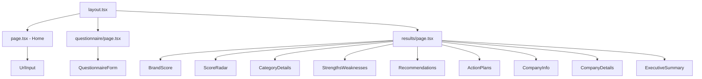

# Brand Value Generator — Complete Documentation

> **Version:** 1.0.0  
> **Last Updated:** July 2026  
> **Stack:** Next.js 16 + Tailwind CSS 4 + Groq AI + Tavily Search

---

## Table of Contents

1. [Project Overview](#1-project-overview)
2. [Technology Stack](#2-technology-stack)
3. [Project Structure](#3-project-structure)
4. [Architecture & Data Flow](#4-architecture--data-flow)
5. [Setup Workflow (Step by Step)](#5-setup-workflow-step-by-step)
6. [API Reference](#6-api-reference)
7. [Component Hierarchy](#7-component-hierarchy)
8. [Library Modules](#8-library-modules)
9. [AI Cost Analysis](#9-ai-cost-analysis)
10. [Brand Evaluation Methodology](#10-brand-evaluation-methodology)
11. [What We Added](#11-what-we-added)
12. [Troubleshooting](#12-troubleshooting)
13. [Future Improvements](#13-future-improvements)
14. [Deployment](#14-deployment)

---

## 1. Project Overview

The **Brand Value Generator** is an AI-powered web application that evaluates a company's brand based on its website content, web presence, and optional questionnaire answers. It produces a comprehensive brand score (0-100), 10 category scores, SWOT analysis, action plans, and company details — including founder info, leadership team, employee count, funding stage, and more.

### Core Capabilities

- Enter any company URL → automatic website scraping
- Optional 12-question brand assessment questionnaire
- Web search integration (social media, reviews, news, competitors)
- AI-powered extraction of company details (founder, CEO, team, funding, employees)
- 10-category brand evaluation with individual scores and reasoning
- SWOT analysis (strengths, weaknesses, risks, opportunities)
- Top 10 prioritized recommendations
- 30-day, 90-day, and 1-year action plans
- Executive summary with final verdict
- Interactive radar chart and animated score gauge

---

## 2. Technology Stack

| Category | Technology | Version | Purpose |
|---|---|---|---|
| **Framework** | Next.js | 16.2.10 | React meta-framework with App Router and API routes |
| **Language** | TypeScript | 5.x | Type safety and developer experience |
| **Styling** | Tailwind CSS | 4.x | Utility-first CSS framework |
| **Font** | Geist (via next/font) | - | Modern sans-serif typeface by Vercel |
| **AI Model** | Groq + Llama 3.1 8B | groq-sdk v0.14 | Brand evaluation inference (JSON mode) |
| **Web Search** | Tavily | @tavily/core v0.7 | Company info, social media, reviews, news discovery |
| **Web Scraper** | Cheerio + Axios | cheerio 1.x, axios 1.x | Website content extraction from main + subpages |
| **Charts** | Recharts | 3.x | Radar/spider chart for 10 category scores |
| **Runtime** | Node.js | >=20.9.0 | Server-side JavaScript execution |

### Why These Choices

| Decision | Rationale |
|---|---|
| **Groq over OpenAI/Gemini** | Free tier available, OpenAI-compatible SDK, fastest inference |
| **Llama 3.1 8B over 70B** | 200K TPM vs 6K TPM on free tier — avoids rate limits |
| **Tavily over SerpAPI** | Purpose-built for AI agents, returns structured data |
| **Cheerio over Puppeteer** | No browser overhead, faster, lighter — enough for most websites |
| **Recharts over Chart.js** | React-native, composable, tree-shakeable |

---

## 3. Project Structure

```
automated-brand-value-generator/
│
├── .env.local                              # API keys (GITIGNORED — never commit)
├── .gitignore
├── package.json
├── tsconfig.json
├── next.config.ts                          # serverExternalPackages: [cheerio]
├── postcss.config.mjs
├── DOCUMENTATION.md                        # This file
│
├── app/                                     # Next.js App Router pages
│   ├── layout.tsx                           # Root layout — fonts, metadata, body wrapper
│   ├── globals.css                          # Tailwind imports + custom animations/colors
│   ├── page.tsx                             # Homepage — hero section + URL input
│   │
│   ├── questionnaire/
│   │   └── page.tsx                         # Read URL from query params → render form
│   │
│   ├── results/
│   │   └── page.tsx                         # Read from sessionStorage → 7-tab dashboard
│   │
│   └── api/
│       ├── evaluate/
│       │   └── route.ts                     # POST — main pipeline: scrape → search → AI
│       └── web-search/
│           └── route.ts                     # POST — independent Tavily search endpoint
│
├── components/                               # Reusable UI components
│   ├── url-input.tsx                         # URL text input + validation + submit button
│   ├── questionnaire-form.tsx                # 12 questions + progress bar + loading animation
│   ├── brand-score.tsx                       # Animated SVG circular gauge (0-100)
│   ├── score-radar.tsx                       # Recharts radar chart with tooltips
│   ├── category-details.tsx                  # Expandable 10-category score breakdown
│   ├── strengths-weaknesses.tsx              # 4-quadrant SWOT grid
│   ├── recommendations.tsx                   # Numbered recommendation cards
│   ├── action-plans.tsx                      # Tabbed 30/90/1-year plans
│   ├── company-info.tsx                      # Extracted company profile (name, industry, etc.)
│   ├── company-details.tsx                   # Founder, team, funding, employees sectioned cards
│   └── executive-summary.tsx                 # Summary + final verdict + confidence note
│
└── lib/                                      # Core logic modules
    ├── groq.ts                               # Groq client initialization + evaluateBrand()
    ├── scraper.ts                            # Website + subpage scraping (cheerio)
    ├── web-search.ts                         # Tavily multi-query search
    ├── questionnaire.ts                      # 12 default brand assessment questions
    └── brand-prompt.ts                       # Complete system prompt (~140 lines)
```

---

## 4. Architecture & Data Flow

### 4.1 User Flow

```
User opens http://localhost:3000
        │
        ▼
┌─────────────────────────────┐
│      HOMEPAGE (page.tsx)    │
│   Enter company URL → Submit │
└──────────┬──────────────────┘
           │
           ▼
┌─────────────────────────────┐
│  QUESTIONNAIRE (page.tsx)   │
│  12 questions or Skip       │
└──────────┬──────────────────┘
           │
           ▼
┌─────────────────────────────┐
│   POST /api/evaluate        │
│   (scrape → search → AI)    │
└──────────┬──────────────────┘
           │
           ▼
┌─────────────────────────────┐
│   RESULTS (page.tsx)        │
│   7-tab dashboard           │
└─────────────────────────────┘
```

### 4.2 API Flow (POST /api/evaluate)

```
Request: { url: "https://example.com", answers: { ... } }
        │
        ▼
┌─────────────────────┐
│  Validate URL       │
│  Normalize to https │
└──────────┬──────────┘
           │
     ┌─────┴─────┐
     ▼           ▼
┌──────────┐ ┌──────────┐
│ SCRAPER  │ │ SEARCH   │
│ lib/     │ │ lib/     │
│ scraper  │ │ web-     │
│ .ts      │ │ search   │
│          │ │ .ts      │
│ Main     │ │          │
│ page +   │ │ 4 queries │
│ /about   │ │ → 15 max │
│ /team    │ │ results   │
│ /company │ │          │
│ /careers │ │ Social,  │
│          │ │ reviews, │
│ headings │ │ news     │
│ meta     │ │          │
│ og:image │ │ rawText  │
└────┬─────┘ └────┬─────┘
     └─────┬──────┘
           ▼
┌─────────────────────┐
│  Build userPrompt   │
│  (website + search  │
│   + questionnaire)  │
│  Truncate to 6000   │
│  chars max          │
└──────────┬──────────┘
           ▼
┌─────────────────────┐
│  groq.evaluateBrand │
│  llama-3.1-8b-     │
│  instant            │
│  JSON mode          │
│  temp: 0.3         │
└──────────┬──────────┘
           │
           ▼
┌─────────────────────┐
│  Parse JSON         │
│  Return response    │
│  to client          │
└─────────────────────┘
```

### 4.3 Component Hierarchy

```
RootLayout
└── page.tsx (Home)
    └── UrlInput
        └── onSubmit → router.push(/questionnaire?url=...)

questionnaire/page.tsx
└── QuestionnaireForm
    ├── Progress bar
    ├── 12 question textareas
    └── Submit / Skip buttons
        └── onClick → POST /api/evaluate → sessionStorage → /results

results/page.tsx
├── Tab navigation (7 tabs)
├── Tab: Overview
│   ├── BrandScore (animated gauge)
│   ├── ScoreRadar (recharts)
│   └── ExecutiveSummary
├── Tab: Category Scores
│   └── CategoryDetails (expandable)
├── Tab: SWOT Analysis
│   └── StrengthsWeaknesses (4 quadrants)
├── Tab: Recommendations
│   └── Recommendations (numbered cards)
├── Tab: Action Plans
│   └── ActionPlans (30/90/1-year tabs)
├── Tab: Company Info
│   └── CompanyInfo (profile)
└── Tab: Team & Company
    └── CompanyDetails (founder, team, funding)
```

---

## 5. Setup Workflow (Step by Step)

### Prerequisites Checklist

```
☐ Node.js >= 20.9.0 installed (node -v)
☐ npm >= 10.x installed (npm -v)
☐ Git installed (git --version)
☐ Code editor (VS Code recommended)
☐ API keys ready (see below)
```

### Step 1: Get API Keys

Create accounts and get API keys from these providers:

#### Primary Setup (Groq + Tavily — $0/mo)

| Service | URL | What to do | Key Format |
|---|---|---|---|
| **Groq** | https://console.groq.com/keys | Sign up → "Create API Key" | `gsk_...` |
| **Tavily** | https://tavily.com | Sign up → Dashboard → API Key | `tvly-...` |

#### Alternative AI Providers ($0 or ~$1/mo)

| Provider | URL | Free Tier Limits | Cost |
|---|---|---|---|
| **Google Gemini** | https://aistudio.google.com/app/apikey | 1,500 req/day | $0 |
| **OpenAI** | https://platform.openai.com/api-keys | $5 free credit | ~$0.08/100 evals |

### Step 2: Setup Project

```bash
# 1. Clone or navigate to project
cd /path/to/automated-brand-value-generator

# 2. Use Node 20+
nvm use 20
# or: nvm install 20 && nvm use 20

# 3. Install dependencies
npm install

# 4. Create environment file
touch .env.local
```

### Step 3: Configure Environment

Edit `.env.local` and add your API keys:

```env
# Required: Choose ONE AI provider
GROQ_API_KEY=gsk_your_groq_key_here

# Optional: Alternative AI providers
# GEMINI_API_KEY=AIza_your_gemini_key_here
# OPENAI_API_KEY=sk-your_openai_key_here

# Required:
TAVILY_API_KEY=tvly-your_tavily_key_here
```

### Step 4: Choose AI Provider

Edit `app/api/evaluate/route.ts` to import from your chosen provider:

```typescript
// For Groq (recommended — free tier available)
import { evaluateBrand } from "@/lib/groq"

// For Gemini (alternative free option)
// import { evaluateBrand } from "@/lib/gemini"

// For OpenAI (paid — requires billing)
// import { evaluateBrand } from "@/lib/openai"
```

### Step 5: Run the App

```bash
# Development mode (hot reload)
npm run dev

# Production build
npm run build
npm start

# Open in browser
# http://localhost:3000
```

### Step 6: Test the App

1. Open http://localhost:3000
2. Enter a company URL (e.g. `https://openai.com` or `https://stripe.com`)
3. Click "Start Evaluation"
4. Answer some questions or click "Skip Questionnaire"
5. Wait ~10-20 seconds for processing
6. View full results dashboard (7 tabs)

### Quick Start (One-Liner)

```bash
nvm use 20 && npm install && npm run dev
```

---

## 6. API Reference

### 6.1 POST /api/evaluate

Main endpoint — scrapes website, searches web, evaluates brand via AI.

**Request:**

```json
{
  "url": "https://example.com",
  "answers": {
    "mission": "Our mission is to...",
    "audience": "Small to medium businesses",
    "usp": "We offer the fastest...",
    "personality": "Professional and innovative",
    "values": "Integrity, Innovation, Customer-first",
    "marketing": "Social media, SEO, email marketing",
    "differentiation": "Lower price, better support",
    "feedback": "NPS surveys, customer interviews",
    "challenges": "Brand awareness in new markets",
    "goals": "Expand to 3 new countries",
    "consistency": "Consistent across all platforms",
    "innovation": "AI-powered features"
  }
}
```

**Response (Full Schema):**

```json
{
  "extractedCompanyInfo": {
    "companyName": "string | null",
    "industry": "string | null",
    "productsOrServices": ["string"],
    "businessDescription": "string | null",
    "targetAudience": "string | null",
    "brandMission": "string | null",
    "brandVision": "string | null",
    "coreValues": ["string"],
    "usp": "string | null",
    "headquarters": "string | null",
    "yearsInBusiness": "string | null",
    "brandPersonality": "string | null",
    "mainCompetitors": ["string"],
    "primaryCallToAction": "string | null",
    "websiteQuality": "string | null",
    "overallProfessionalism": "string | null",
    "companyDetails": {
      "founderName": "string | null",
      "founderBackground": "string | null",
      "ceoName": "string | null",
      "leadershipTeam": [{ "name": "string", "title": "string" }],
      "employeeCount": "string | null",
      "foundedYear": "string | null",
      "fundingStage": "string | null",
      "investors": ["string"],
      "estimatedRevenue": "string | null"
    },
    "digitalFootprint": {
      "socialMediaPresence": [
        { "platform": "string", "handleOrUrl": "string", "followerCount": "number | null", "activityLevel": "string" }
      ],
      "customerReviews": [
        { "source": "string", "rating": "number | null", "reviewCountApprox": "number | null", "sentimentSummary": "string" }
      ],
      "newsOrPressMentions": [
        { "source": "string", "summary": "string", "date": "string | null" }
      ],
      "searchVisibility": "string | null",
      "confirmedCompetitors": ["string"]
    }
  },
  "categoryScores": {
    "brandIdentity": { "score": 0, "reasoning": "string" },
    "websiteExperience": { "score": 0, "reasoning": "string" },
    "customerTrust": { "score": 0, "reasoning": "string" },
    "brandConsistency": { "score": 0, "reasoning": "string" },
    "digitalPresence": { "score": 0, "reasoning": "string" },
    "marketingMaturity": { "score": 0, "reasoning": "string" },
    "competitivePosition": { "score": 0, "reasoning": "string" },
    "customerExperience": { "score": 0, "reasoning": "string" },
    "innovation": { "score": 0, "reasoning": "string" },
    "growthPotential": { "score": 0, "reasoning": "string" }
  },
  "brandScore": 75,
  "brandGrade": "Good",
  "executiveSummary": "string",
  "strengths": ["string"],
  "weaknesses": ["string"],
  "risks": ["string"],
  "opportunities": ["string"],
  "top10Recommendations": ["string"],
  "actionPlan30Day": ["string"],
  "actionPlan90Day": ["string"],
  "brandGrowthStrategy1Year": ["string"],
  "finalVerdict": "string",
  "confidenceNote": "string | null"
}
```

**Error Response:**

```json
{
  "error": "Valid URL is required"
}
```

### 6.2 POST /api/web-search

Standalone search endpoint (used independently or by the evaluate pipeline).

**Request:**

```json
{
  "url": "https://example.com"
}
```

**Response:**

```json
{
  "companyName": "example",
  "socialMedia": [
    { "platform": "LinkedIn", "url": "https://linkedin.com/company/example" },
    { "platform": "X/Twitter", "url": "https://twitter.com/example" }
  ],
  "reviews": [
    { "source": "https://trustpilot.com/...", "snippet": "Great product..." }
  ],
  "news": [
    { "title": "Example raises $10M", "url": "https://techcrunch.com/...", "date": null }
  ],
  "rawResults": "search results as text string"
}
```

### 6.3 Error Codes

| HTTP Status | Meaning | Common Cause |
|---|---|---|
| **400** | Bad Request | Missing/invalid URL |
| **500** | Internal Server Error | AI API failure, scrape timeout |

---

## 7. Component Hierarchy

### 7.1 Page Components



### 7.2 Component Details

| Component | File | Props | State | Key Function |
|---|---|---|---|---|
| **UrlInput** | `url-input.tsx` | none | `url`, `error` | Validates URL format, navigates to questionnaire |
| **QuestionnaireForm** | `questionnaire-form.tsx` | `url: string` | `answers`, `loading`, `error` | POSTs to `/api/evaluate`, stores in sessionStorage |
| **BrandScore** | `brand-score.tsx` | `score`, `grade` | none | Animated SVG circle gauge with gradient |
| **ScoreRadar** | `score-radar.tsx` | `categories` | none | Recharts RadarChart with polar grid |
| **CategoryDetails** | `category-details.tsx` | `categories` | `openIndex` | Expandable accordion with colored bars |
| **StrengthsWeaknesses** | `strengths-weaknesses.tsx` | `strengths`, `weaknesses`, `risks`, `opportunities` | none | 4-color quadrant grid |
| **Recommendations** | `recommendations.tsx` | `recommendations` | none | Numbered cards with gradient badges |
| **ActionPlans** | `action-plans.tsx` | `plan30Day`, `plan90Day`, `plan1Year` | `tab` | 3-tab switcher with action items |
| **CompanyInfo** | `company-info.tsx` | `info: CompanyInfo` | none | Key-value list of company details |
| **CompanyDetails** | `company-details.tsx` | `details: CompanyDetails` | none | Sections: Leadership, Workforce, Funding |
| **ExecutiveSummary** | `executive-summary.tsx` | `summary`, `verdict`, `confidenceNote` | none | Gradient card + note banner |

---

## 8. Library Modules

### 8.1 `lib/groq.ts` — AI Evaluation Client

**Purpose:** Connects to Groq API with Llama 3.1 8B model for brand evaluation.

```typescript
// Function signature
export async function evaluateBrand(userPrompt: string): Promise<BrandResult>
```

**Key details:**
- Model: `llama-3.1-8b-instant` (200K TPM on free tier)
- JSON mode: `response_format: { type: "json_object" }`
- Temperature: 0.3 (deterministic, consistent results)
- Max tokens: 4,000 (enough for full brand assessment)

### 8.2 `lib/scraper.ts` — Website Scraper

**Purpose:** Extracts content from the company website including subpages.

```typescript
export async function scrapeWebsite(url: string): Promise<ScrapedContent>
```

**What it scrapes:**
- Main page: title, meta description, OG image, headings (h1-h3), body text (4,000 chars)
- Subpages: `/about`, `/team`, `/company`, `/careers`, `/about-us`, `/our-team`, `/leadership` (800 chars each)
- All links (up to 50)

**Error handling:** Subpages that fail (404, timeout) are silently skipped.

### 8.3 `lib/web-search.ts` — Tavily Web Search

**Purpose:** Finds social media profiles, customer reviews, news, competitors.

```typescript
export async function searchCompany(url: string): Promise<SearchResult>
```

**Searches run:**
1. `"companyName domain brand company information"` — general info
2. `"companyName founder CEO employees funding"` — people & business

**Results deduplication:** URLs are deduplicated, max 15 unique results.

**Social media detection:** LinkedIn, Twitter/X, Instagram, Facebook, YouTube

**Review detection:** Trustpilot, G2, Capterra, Google Maps, Yelp

### 8.4 `lib/questionnaire.ts` — Brand Questions

**Purpose:** 12 default brand assessment questions mapped to evaluation categories.

| # | Question | Category |
|---|---|---|
| 1 | What is your company's mission and vision? | Brand Identity |
| 2 | Who is your primary target audience? | Brand Identity |
| 3 | What makes your product unique? | Competitive Position |
| 4 | Describe your brand's personality | Brand Identity |
| 5 | What are your core values? | Brand Identity |
| 6 | Which marketing channels do you use? | Marketing Maturity |
| 7 | How do you position against competitors? | Competitive Position |
| 8 | How do you collect customer feedback? | Customer Experience |
| 9 | Biggest branding/growth challenge? | Growth Potential |
| 10 | Goals for next 12 months? | Growth Potential |
| 11 | How consistent is your branding? | Brand Consistency |
| 12 | Recent innovations/improvements? | Innovation |

### 8.5 `lib/brand-prompt.ts` — System Prompt

**Purpose:** ~140-line system prompt that instructs the AI on brand evaluation methodology.

**Structure:**
- Role definition (senior Brand Strategy Consultant)
- Input specifications (URL, website content, questionnaire answers, web search)
- Hard rules (no invented facts, null for unknowns, no score padding)
- STEP 1: Extraction (company info, company details, digital footprint)
- STEP 2: Evaluation (10 categories, 0-10, with evidence-based reasoning)
- Brand score & grade mapping
- Full JSON output schema
- Output requirements (raw JSON only, no markdown)

---

## 9. AI Cost Analysis

### 9.1 Current Setup (Free Tier)

| Service | Free Tier Limits | Monthly Cost |
|---|---|---|
| **Groq** (Llama 3.1 8B) | 6,000 TPM, 200K TPD | **$0** |
| **Tavily** | ~1,000 searches/month | **$0** |
| **Vercel** (hosting) | 100 hrs/mo, 100GB bandwidth | **$0** |
| **Total** | | **$0/mo** |

### 9.2 Cost Per Evaluation

| Model | Input Tokens/Request | Cost/1M Tokens | Cost Per Evaluation |
|---|---|---|---|
| Groq Llama 3.1 8B (free) | ~7,000 | $0 | **$0** |
| Groq Llama 3.3 70B (paid) | ~7,000 | $0.59 | **$0.004** |
| OpenAI GPT-4o Mini | ~5,000 | $0.15 | **$0.00075** |
| OpenAI GPT-4o | ~5,000 | $2.50 | **$0.0125** |
| Gemini 1.5 Flash | ~6,000 | $0.075 | **$0.00045** |

### 9.3 Upgrade Options

| Option | Monthly Cost | TPM Limit | Model Quality | Effort to Switch |
|---|---|---|---|---|
| **A: Stay on Free** | $0 | 6K TPM | Low (8B) | None |
| **B: Mock Mode** | $0 | Unlimited | N/A (simulated) | 10 min to add |
| **C: Groq Paid** | ~$2 | 200K TPM | Medium (70B) | 5 min |
| **D: Gemini** | $0 | ~30 req/min | Medium (Flash) | 10 min |
| **E: OpenAI** | ~$1 | Unlimited | High (GPT-4o Mini) | 15 min |

### 9.4 Recommendation

**Best path forward (in order):**

```
Step 1: ✅ Add Mock Mode (works now, $0)
Step 2: 💰 Upgrade Groq to paid ($2/mo) when ready for real AI
Step 3: 🚀 Switch to Llama 3.3 70B for better quality
```

---

## 10. Brand Evaluation Methodology

### 10.1 The 10 Scoring Categories

| Category | What It Measures | Weight |
|---|---|---|
| **Brand Identity** | Mission, vision, values, personality clarity | 10% |
| **Website Experience** | Design quality, navigation, content clarity, performance | 10% |
| **Customer Trust** | Reviews, testimonials, security signals, transparency | 10% |
| **Brand Consistency** | Uniform messaging across all channels | 10% |
| **Digital Presence** | Social media, SEO, content marketing effectiveness | 10% |
| **Marketing Maturity** | Channel diversity, strategy sophistication, ROI tracking | 10% |
| **Competitive Position** | Differentiation, market share, competitive moat | 10% |
| **Customer Experience** | Feedback loops, support quality, user experience | 10% |
| **Innovation** | Product innovation, process improvement, R&D investment | 10% |
| **Growth Potential** | Market opportunity, scalability, growth trajectory | 10% |

### 10.2 Grade Scale

| Range | Grade |
|---|---|
| 95-100 | Exceptional |
| 90-94 | Excellent |
| 80-89 | Strong |
| 70-79 | Good |
| 60-69 | Average |
| 40-59 | Weak |
| 0-39 | Poor |

### 10.3 Extraction Fields

**Company Profile:** name, industry, products/services, description, target audience, mission, vision, values, USP, headquarters, years in business, brand personality, competitors, CTA, website quality, professionalism

**Company Details (new):** founder name, founder background, CEO name, leadership team (name + title), employee count, founded year, funding stage, investors, estimated revenue

**Digital Footprint:** social media platforms, customer reviews (source + rating + review count + sentiment), news/press mentions, search visibility, confirmed competitors

### 10.4 AI Hard Rules

1. Never invent facts — only use provided data
2. All sourced facts must be traceable
3. `null` for unavailable fields
4. No polite padding of scores
5. Evidence-based justification (2-4 sentences per category)
6. Output valid JSON only (no markdown, no commentary)

---

## 11. What We Added

### 11.1 Founder & Team Details

**Files:**
- `lib/brand-prompt.ts` — Added `companyDetails` extraction block with 9 fields
- `components/company-details.tsx` — New component (3 sections: Leadership, Workforce, Funding)
- `app/results/page.tsx` — Added "Team & Company" tab

**Fields extracted:** founderName, founderBackground, ceoName, leadershipTeam[], employeeCount, foundedYear, fundingStage, investors[], estimatedRevenue

### 11.2 Subpage Scraping

**Files:**
- `lib/scraper.ts` — Added `scrapeSinglePage()` function, scrapes 7 subpages

**Subpages scraped:** `/about`, `/team`, `/company`, `/careers`, `/about-us`, `/our-team`, `/leadership`

**Fallback:** Failed pages are silently skipped, never crash the pipeline.

### 11.3 Multi-Query Web Search

**Files:**
- `lib/web-search.ts` — Changed from 1 query to 2 targeted queries

**Queries:**
1. General brand info
2. Founder/CEO/employees/funding specific search

**Deduplication:** URL-based dedup, max 15 results, sliced and tagged by type.

### 11.4 Rate Limit Mitigation

**Files:**
- `lib/scraper.ts` — Reduced main page text 8K→4K, subpage text 2K→800
- `lib/web-search.ts` — Reduced queries 4→2, results 8→5 per query
- `lib/groq.ts` — Switched from 70B (6K TPM) to 8B (200K TPM)
- `app/api/evaluate/route.ts` — Added total prompt cap at 6,000 chars

---

## 12. Troubleshooting

### 12.1 Groq 413 Error (Request Too Large)

```
Error: Request too large for model... Limit 6000, Requested 7383
```

**Cause:** Free tier TPM limit (6K for 8B, 12K for 70B). The system prompt + website content exceeds the limit.

**Solution:**
- Wait 1 minute and retry (TPM resets)
- Upgrade to Groq paid tier ($2/mo) for 200K TPM
- Add mock mode fallback (recommended)

### 12.2 Groq 429 Error (Rate Limit)

```
Error: 429 Too Many Requests... Please retry in 31s
```

**Cause:** Exceeded requests per minute/day on the free tier.

**Solution:**
- Wait the specified retry time
- Reduce usage frequency
- Upgrade to paid tier

### 12.3 OpenAI 429 Error (Quota Exceeded)

```
Error: You exceeded your current quota
```

**Cause:** No billing set up or credits exhausted on your OpenAI account.

**Solution:**
- Add billing at https://platform.openai.com/settings/organization/billing
- Switch to Groq or Gemini

### 12.4 Gemini 429 Error (Quota Exceeded)

```
Error: Quota exceeded for metric... limit: 0
```

**Cause:** Daily or per-minute quota exhausted on free tier.

**Solution:**
- Wait ~1 minute (per-minute resets)
- Create a new Google Cloud project for fresh quota
- Try a different model name (gemini-1.5-pro, gemini-2.5-pro-exp)

### 12.5 Scraper Fails to Load

```
Error: axios error... connect ECONNREFUSED
```

**Cause:** Website is unreachable, blocks scraping, or uses heavy JavaScript rendering.

**Solution:**
- Verify the URL is correct
- Some sites block cheerio scraping (use a different URL)
- Sites requiring JavaScript (SPAs) won't scrape well — this is a limitation of cheerio

### 12.6 Build Errors

```
Type error: Type 'X' is not assignable to type 'Y'
```

**Solution:**
- Run `npm run lint` to find issues
- Check TypeScript types match between API response and component props
- Rebuild with `nvm use 20 && npm run build`

---

## 13. Future Improvements

### Priority: High

| Feature | Description | Effort | Impact |
|---|---|---|---|
| **Mock/Demo Mode** | Fallback sample data when AI fails | 1 day | High — unblocks all users |
| **PDF Report Export** | Downloadable brand report | 2 days | High — professional use |
| **User Accounts** | Save evaluation history | 3 days | Medium — return visits |

### Priority: Medium

| Feature | Description | Effort | Impact |
|---|---|---|---|
| **Competitive Benchmarking** | Compare scores against similar companies | 3 days | High |
| **Brand Tracking** | Re-evaluate over time, track changes | 2 days | Medium |
| **Social Media Analytics** | Deeper social media metrics from APIs | 2 days | Medium |
| **Multi-language** | Support non-English websites | 1 day | Medium |

### Priority: Low

| Feature | Description | Effort |
|---|---|---|
| **Dark Mode** | Theme toggle | 1 day |
| **Image Analysis** | Analyze brand colors, logo from website | 2 days |
| **Domain Authority** | Integrate Moz/ahrefs API | 1 day |
| **Custom Questions** | User-defined questionnaire | 2 days |
| **API Key Management** | In-app API key configuration | 2 days |

---

## 14. Deployment

### 14.1 Vercel (Recommended, Free)

```bash
# Install Vercel CLI
npm install -g vercel

# Login
vercel login

# Deploy (first time)
vercel

# Set environment variables
vercel env add GROQ_API_KEY
vercel env add TAVILY_API_KEY

# Deploy to production
vercel --prod
```

**Environment Variables to set on Vercel:**
- `GROQ_API_KEY` — your Groq key
- `TAVILY_API_KEY` — your Tavily key

### 14.2 Manual Build

```bash
# Build
npm run build

# Start production server
npm start

# Default: http://localhost:3000
```

### 14.3 Docker (Optional)

```dockerfile
FROM node:20-alpine
WORKDIR /app
COPY package*.json ./
RUN npm ci
COPY . .
RUN npm run build
EXPOSE 3000
CMD ["npm", "start"]
```

```bash
docker build -t brand-value-generator .
docker run -p 3000:3000 -e GROQ_API_KEY=xxx -e TAVILY_API_KEY=xxx brand-value-generator
```

### 14.4 Environment Variables Quick Reference

| Variable | Required | Description |
|---|---|---|
| `GROQ_API_KEY` | Yes (or Gemini/OpenAI) | AI inference API key |
| `TAVILY_API_KEY` | Yes | Web search API key |
| `GEMINI_API_KEY` | Alternative to Groq | Google Gemini API key |
| `OPENAI_API_KEY` | Alternative to Groq | OpenAI API key |

---

## 15. Why This Matters for Today's World

### 15.1 The Brand Value Gap

Most small-to-medium businesses (SMBs) — which make up **99% of all companies** globally — operate without any brand strategy. They build websites, run social media, and create content without knowing their brand's actual health, value, or areas for improvement.

| Brand Assessment Option | Cost | Accessible to SMBs? |
|---|---|---|
| Hire a brand strategy consultant | **$5,000-$50,000** | ❌ No |
| Enterprise brand tracking tools (Brandwatch, Qualtrics) | **$10,000+/year** | ❌ No |
| **This tool** | **$0/mo** | ✅ **Yes** |

### 15.2 The Problem This Solves

| Problem | How This Tool Solves It |
|---|---|
| **Brand strategy is too expensive** | Zero-cost AI-powered assessment — anyone with a website can get professional-grade brand intelligence in 30 seconds |
| **Founders don't know their brand health** | Data-driven scoring (0-100) across 10 categories with specific evidence, not subjective opinions |
| **No visibility into leadership perception** | Extracts founder/CEO/team info from public web data — shows how the company presents its people |
| **Action plans are vague** | Delivers 30/90/365-day concrete action items, not generic advice |
| **Competitive blind spots** | Automatically identifies competitors, social media gaps, market positioning issues |
| **Investors check digital presence** | 82% of investors check a company's online presence before meetings — this tool surfaces what they see |

### 15.3 Who Benefits & How

| Role | How They Use It |
|---|---|
| **Founder / CEO** | Understand if brand messaging matches reality; identify funding/revenue perception gaps |
| **Marketing Manager** | Get a prioritized action plan with clear timelines and measurable outcomes |
| **Brand Strategist** | Baseline measurement before and after brand initiatives |
| **Investor / VC** | Quick diligence on a company's market positioning, digital maturity, and team presentation |
| **Agency** | Client onboarding audit — identify upsell opportunities in 30 seconds |
| **Freelancer** | Portfolio-grade brand analysis for potential clients — looks professional, costs nothing |
| **Product Manager** | See if brand perception matches product quality and roadmap |

### 15.4 Real-World Use Cases

| Use Case | How To Apply It | Expected Outcome |
|---|---|---|
| **Pre-funding brand audit** | Run the tool on your startup before investor meetings | Identify digital presence gaps that investors will notice |
| **Acquisition due diligence** | Evaluate target company's brand health from public data | Surface brand risks before making an offer |
| **Rebranding baseline** | Get a score → rebrand → get a new score | Measure ROI of rebranding efforts |
| **Competitor landscape** | Run on 5 competitors in one afternoon | Map competitive strengths, weaknesses, and positioning |
| **Quarterly brand health** | Run the tool every 90 days | Track brand score trends, measure improvement |
| **New market entry** | Run on companies in your target region | Understand regional brand expectations |
| **Hiring brand audit** | Run on your own company before recruiting | Ensure brand image attracts top talent |

### 15.5 Market Context (2026)

- **78%** of consumers say brand trust directly influences purchasing decisions
- **63%** of companies with documented brand strategies outperform their competitors
- **82%** of investors check a company's digital presence before agreeing to a meeting
- Average company spends **8-12% of revenue** on marketing — but less than **1%** on measuring brand effectiveness
- Companies with strong brands outperform weak brands by **20% in revenue growth** (interbrand)

### 15.6 The Bottom Line

This tool closes a critical gap in the market: **zero-cost, professional-grade brand intelligence** that used to cost thousands of dollars and weeks of consultant time. It makes brand strategy accessible to:

- **Bootstrapped startups** that can't afford consultants
- **SMBs in developing markets** where brand expertise is scarce
- **Non-profits and social enterprises** that need to communicate effectively on a budget
- **Early-stage founders** preparing for their first funding round
- **Solo entrepreneurs** building their personal brand alongside their company brand

**Brand intelligence is no longer a luxury. It's a right — and now it's free.**

---

## Quick Reference Card

```bash
# Setup
nvm use 20
npm install

# Configure
# .env.local:
#   GROQ_API_KEY=gsk_...
#   TAVILY_API_KEY=tvly-...

# Run
npm run dev     # Development (hot reload)
npm run build   # Production build
npm start       # Production server

# URL
http://localhost:3000
```
